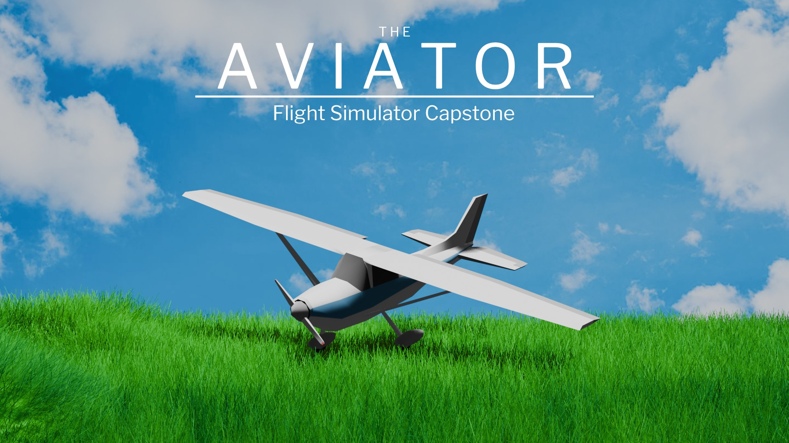

## The Aviator - Flight Simulator Capstone

<!-- TABLE OF CONTENTS -->

  
Table of Contents

  <ol>
    <li>
      <a href="#about-the-project">About The Project</a>
      <!-- <ul>
        <li><a href="#built-with">Built With</a></li>
      </ul> -->
    </li>
    <li>
      <a href="#getting-started">Getting Started</a>
      <ul>
        <li><a href="#prerequisites">Prerequisites</a></li>
        <li><a href="#user-manual">User Manual</a></li>
        <li><a href="#application-hardware">Application Hardware</a></li>
        <li><a href="#download">Download</a></li>
      </ul>
    <li>
      <a href="#user-controls">User Controls</a>
    </li>
    <li>
      <a href="#graphical-interface">Graphical Interface</a>
    </li>
  </ol>

## About The Project
This project is designed for the 2025 GCU Flight Simulator Capstone. This project aims to create a custom flight simulator experience built of Microsoft Flight Simulator. The simulator frame will feature a custom-built instrumentation panel, integrating two display sources to showcase graphical modules. Various input sources will be included, integrated with an Arduino Mega 2560. This Application is designed to bridge the flow of data communication between peripheral devices with Microsoft flight simulator, and to create custom graphical modules based on those found in a Cessna-152 Aircraft. 

## Getting Started
### Prerequisites
This application requires .NET 4.7.2.

For to use all features, a licensed copy of Microsoft Flight simulator must be owned and installed.

### User Manual
The user manual for this project can be found here: [Flight SIm Capstone User Manual](<https://github.com/TJx5x3/FlightSimCapstone/blob/f65d25aa2f1e3908bbe715bc6e03209404f7f125/FlightSImulatorCapstone%20-%20User%20Manual.pdf>)

### Application Hardware
This application was specifically designed to create a flight simulator using the following hardware:
* Arduino Mega 2560
* Thrustmaster T.Flight Rudder Pedals
* CH Products Flight Sim Yoke

### Download
The .msi installer can be found Here:
[FlightSimCapstoneInstaller.msi (x64)](https://github.com/TJx5x3/FlightSimCapstone/raw/refs/heads/master/FlightSimCapstoneInstaller.msi)

## User Controls
### Yoke
The yoke is the steering wheel, allowing users to control the pitch and roll of the virtual aircraft.

<b>NOTE: </b>
If the airplane stalls, the button by the user's left index finger can be used to turn the magneto (turn key).

### Rudder Pedals
The rudder pedals are used to control the yaw of the virtual aircraft. When taxiing, the rudder pedals are used to steer.

### Flap Switch
The flap switches allow users to set the angle of the flaps on the wings to 0, 10, 20, or 30 degrees. They are used to increase or decrease drag.

### Trim Wheel
The trim wheel is used to adjust the pitch calibration of the yoke. This is calibrated through Microsoft Flight Simulator instead of the trim wheel on the yoke.

### Throttle Box
The throttle box has three three knobs for
* Throttle: Control throttle power.
* Mixture: Control the fuel/air ratio of the engine. This is needed to start the aircraft.
* Parking Brake:  Toggle the parking brake on/off.

## Graphical Interface
* <b>Airspeed Indicator:</b> Displays the horizontal airspeed in knots.
* <b>Attitude Indicator: </b> Artificial horizon. Displays the aircraft's roll and pitch.
* <b>Turn Coordinator: </b> Shows the aircraft's roll in degrees.
* <b>Heading Indicator: </b> Shows the aircraft's heading direction.
* <b>Suction Gauge: </b> Shows the amount of suction present in the engine.
* <b>Vertical Airspeed Indicator: </b>Shows aircraft's vertical airspeed in ft/minute.
* <b>Altimeter: </b> Shows aircraft altitude above sea level.
  * Shortest arm: 10,000 ft.
  * Middle arm: 1,000 ft.
  * Tallest/narrowest arm: 100 ft.
* <b>Clock:</b> Analog clock that shows simulator time.

## Licence
[MIT](https://raw.githubusercontent.com/TJx5x3/FlightSimCapstone/refs/heads/master/LICENSE.txt)
